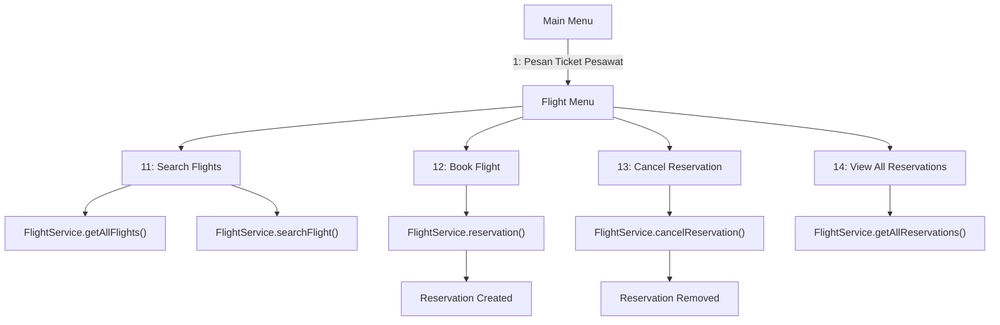

# minitraveloka-java


# minitraveloka-java

Aplikasi konsol sederhana untuk memesan tiket penerbangan (tugas kuliah). Aplikasi menyediakan menu interaktif untuk mencari penerbangan, memesan, membatalkan reservasi, dan melihat daftar reservasi.

---

## Struktur Folder

```text
minitraveloka-java/
├── Main.java                        # Entry point & router menu utama
├── Services/
│   ├── Flights/                     # Modul Penerbangan
│   │   ├── Flight.java
│   │   ├── FlightService.java
│   │   └── FlightMenu.java
│   ├── Customer/
│   │   └── Customer.java
│   └── Reservation/
│       ├── Reservation.java
│       └── ReservationInterface.java
├── README.md
```

---

## Cara Menjalankan

1. Kompilasi semua file Java (jalankan dari root `minitraveloka-java`):

```bash
javac Main.java
```

2. Jalankan aplikasi:

```bash
java Main
```

Catatan: Pastikan JDK (javac/java) sudah terpasang dan tersedia di `PATH`.

---

## Alur Aplikasi (ringkas)

- `Main` menampilkan menu utama dan membuat instance `FlightService` serta `FlightMenu`.
- `FlightMenu` menangani input pengguna untuk aksi: mencari (`11`), memesan (`12`), membatalkan (`13`), dan melihat semua reservasi (`14`).
- `FlightService` menyimpan data penerbangan contoh di memori dan bertanggung jawab membuat/membatalkan `Reservation`.

---

## Diagram Alur (Mermaid)



